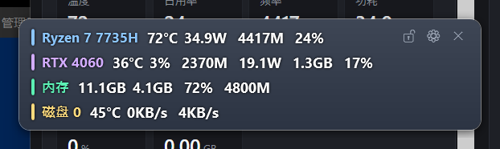

# 轻量硬件监控 LiteHwMon

轻量化 Windows 硬件监控工具：低资源占用、实时曲线、可游戏内悬浮显示（OSD）。
功能对齐 HWiNFO / Libre Hardware Monitor 的核心部分，界面为深色现代风格。


---

> [!IMPORTANT]
> ## 首次使用必读
>
> **CPU 温度与风扇转速依赖 PawnIO 驱动。未安装 PawnIO 时，这两项显示「不可用」，其余数据（占用率、频率、功耗、GPU、内存、磁盘）不受影响。**
>
> 1. 程序启动后自动检测 PawnIO。未安装时，主窗口顶部出现提示条「未检测到 PawnIO 驱动…」。
> 2. 点提示条上的 **「安装 PawnIO →」**：程序自动下载官方安装包、校验 Authenticode 签名后静默安装。
> 3. **安装后必须重启本程序**（LibreHardwareMonitor 只在启动时连接该驱动）。
>
> 手动安装见 [PawnIO 依赖说明](#pawnio-依赖说明)。程序不会安装任何未签名的驱动。

### 状态栏显示的三种情况（含义不同，请勿混淆）

| 状态栏显示 | 原因 | 能否解决 |
| --- | --- | --- |
| `温度需安装 PawnIO 驱动`<br>`温度需 PawnIO · 功耗走 RAPL` | **未安装 PawnIO** | **能**：安装 PawnIO 并重启本程序 |
| `该平台不提供 CPU 温度传感器` | PawnIO 已在位、驱动可用，但该主板/固件不暴露该传感器 | **不能**：硬件与固件限制，安装任何组件都无效 |
| `CPU 遥测不可信（该平台 SMU 读数异常）` | 能读到读数，但自检判定该读数不成立 | **不能**：平台遥测实现问题；程序不显示该可疑数值 |

CPU 温度磁贴显示「不可用」时，鼠标悬停可看到属于上表哪一种情况。

---

## 功能

**主窗口**

- **CPU**：型号、温度<sup>†</sup>、占用率、频率、功耗
- **GPU**：每块显卡独立卡片 —— 温度、占用率、核心频率、功耗、显存占用/占用率
- **内存**：容量/代数/频率（SMBIOS）、已用、可用、占用率
- **硬盘**：每块盘独立卡片 —— 温度、活动率、读取/写入速度、已用空间
- **风扇**<sup>†</sup>：转速 RPM（主板 SuperIO / EC，风扇在转时显示）
- **实时曲线**：温度 / 占用率 / 频率 / 功耗 / 风扇 / 磁盘速率 六个页签，时间窗口 1/5/10/30 分钟
- **统计**：每条曲线的 当前 / 最小 / 最大 / 平均，表头标注统计窗口；点击图例可显示/隐藏单条曲线
- **刷新间隔**：0.5 / 1 / 2 / 5 秒可配（状态栏切换）
- **后台低占用**：最小化到托盘后暂停全部 UI 更新与图表重绘，仅保留数据采样；隐藏窗口时自动修剪工作集
- **参数说明**：硬盘活动率等不直观的指标，磁贴右上角带 `?` 图标，鼠标悬停即说明含义、数值口径与数据来源
- 读取不到的传感器一律显示 **不可用**，不显示推断值或占位值

<sup>†</sup> 需要 PawnIO 驱动，见 [PawnIO 依赖说明](#pawnio-依赖说明)。

**系统托盘**

- 标题栏最小化按钮 / 系统最小化 → 隐藏窗口到系统托盘，进程继续采样（首次最小化有气泡提示）
- **双击托盘图标**：恢复主窗口
- **右键托盘图标**：「显示窗口」「OSD 悬浮窗」（可勾选）「锁定 OSD（鼠标穿透）」（可勾选）「OSD 设置…」「启动时请求管理员权限」（可勾选）「退出应用」
- **「退出应用」二次确认**（标题栏 ✕ 同样确认）：取消则继续后台运行；确认后关闭主窗口、OSD、设置窗口，停止监控引擎与后台线程，移除托盘图标，释放单实例锁
- **退出兜底看门狗**：若驱动 IO 卡死导致优雅退出未在 3 秒内完成，强制结束进程，不留残余
- 重复启动不弹"已启动"错误：直接唤醒已在运行的实例；若上次退出留下无响应的残留进程，询问后结束它并继续启动
- 启动顺序为**先提权、再判定单实例**：保证第二次启动与已在运行的实例处于同一权限级别，从而能可靠唤醒其窗口

**游戏监控 OSD（悬浮窗）**

- 主窗口标题栏 **OSD 按钮** 一键开启 / 关闭
- 紧凑显示：每行一个硬件模块（CPU / GPU×N / 内存 / 硬盘×N / 风扇×N），彩色标识
- **硬件名称显示模式**：`硬件型号`（默认，显示 `Ryzen 7 7735H`、`RTX 4060`）或 `通用名称`（显示 `CPU`、`GPU`、`GPU2`）
- **指标默认只显示数值**（`65°C`、`85W`、`72%`）；开启「显示指标前缀」后显示 `温度：65°C`、`功耗：85W`
- 基于实际探测到的硬件/传感器列表动态生成 **硬件 + 参数** 两级配置，两级均可独立勾选显示/隐藏
- **编辑 / 锁定两种模式**：
  - **默认解锁、可直接拖动**：打开 OSD 后先把它拖到合适位置
  - 摆好位置后再锁定：点右上角 🔓 进入锁定模式。锁定后保持置顶 + **鼠标点击穿透**（点击 OSD 区域直接落到下层游戏/窗口），禁止拖动，避免误操作
  - 首次锁定会先说明锁定后果与解锁方式，确认后才生效（只提示一次）
  - 锁定后仅右上角按钮条仍可点击（否则无法解锁），按钮条会自动提亮；托盘菜单也提供「锁定 OSD（鼠标穿透）」开关
  - 点 🔒 或托盘菜单即可解锁，恢复拖动与鼠标交互
  - 位置与锁定状态持久化，重启后恢复
- **文字与背景解耦**：`背景不透明度`、`背景深浅` 只作用于背景板；文字与数值恒为 100% 亮度
- **三级视觉层级**：数值纯白加粗 > 指标前缀亮灰 > 不可用项减弱灰；硬件名使用强调色
- **文字描边**：数值带四周对称深色光晕，复杂画面上仍可辨认
- `背景不透明度 = 0%` 时背景板与描边一并移除，为纯文字悬浮
- 内容或字号变化后自动重新钳制到屏幕内，指标不会被挤出屏外
- 位置与锁定状态自动保存，重启后恢复
- `WS_EX_NOACTIVATE`：不抢游戏焦点、不出现在 Alt+Tab；窗口化 / 无边框游戏可正常悬浮
- 与主窗口共用同一份采样引擎，不额外增加采样线程



## PawnIO 依赖说明

### 作用

PawnIO 是一个可脚本化的通用内核驱动，为 LibreHardwareMonitor 提供底层硬件访问。
LibreHardwareMonitor 0.9.5 起用 PawnIO 取代 WinRing0（上游 PR #1857），并通过其中的
`RyzenSMU` / `LpcIO` / `LpcACPIEC` 等模块读取 CPU 与主板传感器。

### 为什么必须安装

以下数据只能经 PawnIO 读取，没有替代来源：

| 数据 | 说明 |
| --- | --- |
| **AMD CPU 温度**（Tctl/Tdie） | 位于 SMN 空间，只能通过 PCI 配置空间的间接索引/数据寄存器读取 |
| **风扇转速** | 位于主板 SuperIO / EC，需要端口与 EC RAM 访问 |
| 主板温度等 SuperIO 传感器 | 同上 |

随本程序分发的 WinRing0 驱动（仅用于 RAPL 功耗回退）**不具备**上述能力：该驱动被上游精简为只保留 MSR 读写，只暴露 6 个 IOCTL，IO 端口读取恒返回 `ERROR_GEN_FAILURE`。

**不受影响的数据**：CPU 占用率、CPU 频率、CPU 功耗（RAPL MSR 直读，不需要 PawnIO）、全部 GPU 数据、内存、磁盘温度与读写速度。

### 安装

**方式一：程序内自动安装（推荐）**

1. 主窗口顶部提示条 → 点 **「安装 PawnIO →」**
2. 程序依次执行：下载官方安装包 → 校验 Authenticode 签名与签名者 → 以 `-install -silent` 静默安装
3. 安装完成后按钮变为 **「立即重启 →」**，点击重启程序

签名校验失败或下载失败时，程序拒绝安装并在提示条上显示原因。

**方式二：手动安装**

1. 下载安装器（官方地址）：
   <https://github.com/namazso/PawnIO.Setup/releases/latest/download/PawnIO_setup.exe>
   发布页：<https://pawnio.eu/>
2. 运行 `PawnIO_setup.exe`，按向导完成安装（需要管理员权限）
3. 关闭并重新启动本程序

**方式三：命令行**

```powershell
LiteHwMon.exe --install-pawnio [结果输出文件]
```

与方式一走同一条代码路径，安装结果写入 `%APPDATA%\LiteHwMon\pawnio-install.log`，退出码 0 表示成功。

### 安装后必须重启

LibreHardwareMonitor 在程序启动时连接该驱动一次。运行中的程序在 PawnIO 安装完成后**不会**自动获得温度数据，必须重启本程序。

### 三种「温度不可用」的区分

| 判定条件 | 状态栏显示 | 处理 |
| --- | --- | --- |
| AMD 平台 + 未安装 PawnIO | `温度需安装 PawnIO 驱动` | 安装 PawnIO → 重启程序 |
| PawnIO 已在位 + 驱动可用 + 仍无温度 | `该平台不提供 CPU 温度传感器` | 无解，属硬件/固件限制 |
| 能读到数值 + 自检判定读数不成立 | `CPU 遥测不可信（该平台 SMU 读数异常）` | 无解，程序改为显示「不可用」 |

程序不会把第二种、第三种情况提示成"请安装 PawnIO"，避免给出无效建议。

### 已验证不可用的替代来源

以下来源经实测不成立，因此未作为数据源：

| 候选来源 | 实测结果 |
| --- | --- |
| `MSAcpi_ThermalZoneTemperature`（ACPI 热区） | 恒为 71.1 °C；16 线程满载 30 秒后数值不变 → 固件占位值 |
| PDH `Thermal Zone Information` | 与上者同源，恒为 70.9 °C |
| WinRing0 IO 端口 → PCI 配置空间 0xCF8/0xCFC | 读取恒返回 `ERROR_GEN_FAILURE` |
| RAPL MSR（仅功耗） | 数值在 22% 与 100% 负载下恒为 35.0 W → 见下节 |

### 已知平台偏差：AMD SMU 遥测可能不成立

部分平台上，即使安装了 PawnIO，SMU 读数在物理上仍不成立。开发机（Ryzen 7 7735H / Rembrandt）实测：

| 条件 | `Core (Tctl/Tdie)` | 封装功耗 |
| --- | --- | --- |
| 空闲（CPU 22%，4.07 GHz） | 71.4 °C | 35.0 W |
| 16 线程满载（CPU 100%，4.36 GHz） | **66.3 °C（下降）** | **35.0 W（不变）** |

负载升高时温度下降、功耗在 22% 与 100% 负载下完全相同；LHM 的 SMU 与自带 RAPL MSR 两条独立通路结果一致，说明该平台未真正实现这组遥测。

程序内置自检（`Core/CpuTelemetryCheck.cs`）：仅在观测到 ≥45 个百分点的负载跨度后、功耗读数跨度仍 <0.8 W 时判定可疑。判据保守，正常平台不会误报（正反例均有单元测试覆盖）。

## 数据源与可靠性策略

| 数据 | 首选来源 | 回退来源（无需内核驱动） |
| --- | --- | --- |
| CPU 温度 | LibreHardwareMonitor（**需要 PawnIO**） | 无 → 显示「不可用」 |
| CPU 功耗 | LibreHardwareMonitor 传感器 | RAPL MSR 直读（自带 WinRing0，只读 MSR，不需要 PawnIO） |
| CPU 频率 | LibreHardwareMonitor 各核时钟取最大 | `% Processor Performance` × 标称频率估算 |
| CPU 占用率 | 系统计数器（始终使用） | — |
| NVIDIA GPU 全套 | 驱动自带 NVML 直连（无需提权） | LibreHardwareMonitor 传感器 |
| AMD/Intel GPU | LibreHardwareMonitor | GPU Engine / GPU Adapter Memory 计数器 |
| 内存 | GlobalMemoryStatusEx + WMI SMBIOS | — |
| 硬盘温度/读写 | LibreHardwareMonitor（SMART） | PhysicalDisk 计数器 |
| 风扇 | LibreHardwareMonitor（SuperIO，**需要 PawnIO**） | 无 → 显示「不可用」 |

- LHM 硬件刷新带**逐硬件看门狗**：单个硬件的驱动 IO 卡死时只拉黑该硬件（其传感器显示不可用），按退避策略重试，不影响其他硬件
- 逐硬件刷新预算 1.5 秒；全局预算随硬件数量放大，避免多硬件机型被误判为驱动无响应
- 同一时刻只允许一轮 LHM 刷新在运行，防止并发调用同一硬件
- GPU 性能计数器采用 PDH 通配符批量查询，一次读取全部实例
- 正常状态单轮轮询开销约 1 ms（冒烟工具会打印分项计时）

## 运行要求

- Windows 10 / 11（x64）
- [.NET 8 Desktop Runtime](https://dotnet.microsoft.com/download/dotnet/8.0)（框架依赖发布）；或使用自包含发布，无需安装运行时
- **管理员权限**：读取 CPU 功耗、风扇转速、硬盘 SMART 需要内核驱动访问。程序启动时自动请求提权（可在托盘菜单关闭）。拒绝提权时程序仍可运行，此时 CPU 功耗、风扇显示「不可用」，其余数据正常
- **PawnIO**：AMD 平台的 CPU 温度与风扇转速需要它。程序内提供一键安装，也支持手动安装
- 若系统启用内核隔离（内存完整性 / HVCI），未签名的内核驱动会被拒绝加载。PawnIO 为官方签名驱动，不受影响；本程序自带的 WinRing0 会被拒绝，届时 CPU 功耗（RAPL 回退）不可用

### 杀毒软件提示

RAPL 功耗回退使用随包分发的 WinRing0 驱动（只读 MSR）。部分杀软（如火绒、360）会拦截驱动加载，此时 CPU 功耗显示「不可用」。请在杀软中信任本程序或恢复被拦截的驱动。

## 使用 OSD

1. 主窗口标题栏点击 **OSD** 开启 / 关闭悬浮窗；托盘菜单同样可开关，并可一键「锁定 OSD（鼠标穿透）」
2. 点击悬浮窗右上角 **⚙** 打开设置，全部实时生效并自动保存：
   - **显示内容**：按硬件（CPU / 每块 GPU / 内存 / 每块硬盘 / 风扇）与指标（温度 / 占用率 / 频率 / 功耗 / 显存 / 读写…）两级勾选；每一项都可独立显示或隐藏
   - **布局排列**：竖排分行 / 横排单行 / 横排自动换行；行间距与指标间距独立可调；可隐藏硬件名称或指标前缀
   - **硬件名称显示模式**：`硬件型号` / `通用名称`
   - **显示指标前缀**：关闭时只显示 `65°C`，开启后显示 `温度：65°C`
   - **字号**：基础字号 + 硬件名称倍率 + 指标数值倍率，三者独立调节
   - **外观**：`背景不透明度`、`背景深浅`、`文字描边`、`窗口置顶`
   - **位置**：九宫格一键定位，或直接拖动悬浮窗（位置自动记忆）
3. OSD **默认可直接拖动**。摆好位置后点右上角 **🔓** 锁定：保持置顶、鼠标点击穿透、禁止拖动（首次锁定会先说明后果，确认后才生效）；再点 **🔒** 或托盘菜单解锁
4. 指标不可用时显示「—」
5. 独占全屏（Exclusive Fullscreen）游戏会覆盖系统级悬浮窗；无边框全屏 / 窗口化正常显示

### 可读性调节

文字亮度固定为 100%，可读性由以下两项调节：

| 目标 | 调整 |
| --- | --- |
| 复杂画面上仍清晰 | `文字描边` 保持开启（默认开启） |
| 最高对比度 | 提高 `背景不透明度`，并将 `背景深浅` 调深 |
| 尽量少遮挡画面 | 降低 `背景不透明度`；纯白加粗文字 + 描边仍可辨认 |

### 硬盘活动率

「活动率」是可选指标，需要时在 OSD 设置里单独勾选。**主窗口磁盘卡片上「活动率」磁贴的右上角**、以及 **OSD 设置窗口中对应选项的旁边**，都有一个 **`?`** 图标，鼠标悬停显示完整说明：

- **是什么**：采样周期内磁盘处于忙碌状态的时间占比
- **数值含义**：衡量“忙不忙”而非“快不快”，与吞吐量没有固定关系
- **数据来源**：优先读硬盘 SMART 的 Activity 传感器；读不到时回退到 Windows 性能计数器 `PhysicalDisk\% Idle Time`，按 `100 − 空闲率` 换算
- **适用场景**：判断卡顿是否由磁盘引起、观察后台更新与杀软扫描的持续占用

## 托盘与退出

- **最小化 = 进托盘**：窗口隐藏、进程保留、采样继续、工作集自动修剪
- **双击托盘图标**恢复窗口；**右键**可显示窗口、开关 OSD、打开 OSD 设置、退出应用
- **退出有二次确认**；取消即继续后台运行，确认则完整退出并释放单实例锁
- **不残留进程**：退出时依序停止监控引擎与后台线程、销毁托盘图标、关闭全部窗口；另有 3 秒兜底看门狗
- **不会卡在"应用已经启动"**：第二次启动唤醒已在运行的实例；若检测到上次未能正常退出的残留进程（窗口已无响应），询问后结束它并继续启动

## 构建与发布

```powershell
# 构建（需要 .NET 8 SDK）
dotnet build src/LiteHwMon/LiteHwMon.csproj -c Release

# 发布：框架依赖单文件（约几 MB，目标机需 .NET 8 Desktop Runtime）
powershell -ExecutionPolicy Bypass -File publish.ps1

# 发布：自包含单文件（约 150MB，目标机零依赖）
powershell -ExecutionPolicy Bypass -File publish.ps1 -SelfContained
```

冒烟测试（控制台打印全部传感器读数，用于确认某台机器上哪些项可用，建议以管理员身份运行）：

```powershell
dotnet run --project src/SmokeTest -c Release
```

## 项目结构

```
src/LiteHwMon/
├── Core/
│   ├── MonitorEngine.cs     # 轮询引擎：LHM 传感器 + 看门狗 + 自适应降频
│   ├── SystemFallbacks.cs   # 无驱动回退：PDH 通配符批量查询 / 内存 / WMI
│   ├── Nvml.cs              # NVIDIA NVML 直连（温度/占用/频率/功耗/显存）
│   ├── Readings.cs          # ReadingSpec / SensorHistory 环形缓冲
│   ├── AppSettings.cs       # 配置持久化（%APPDATA%\LiteHwMon）
│   ├── SingleInstance.cs    # 单实例锁 + 唤起已有实例 + 残留进程识别
│   ├── PrivilegedBackend.cs # PawnIO / WinRing0 后端探测
│   ├── PawnIoInstaller.cs   # PawnIO 一键安装（下载 + 验签 + 静默安装）
│   └── CpuTelemetryCheck.cs # CPU 遥测可信度自检
├── Ui/
│   ├── SensorChart.cs       # 自绘轻量曲线控件（无第三方图表库）
│   ├── Vm.cs                # 主界面视图模型
│   ├── OsdVm.cs             # OSD 行/单元格模型、模块定义与配色
│   └── Converters.cs
├── MainWindow.xaml          # 主界面：设备卡片 + 实时曲线 + 图例 + 托盘菜单
├── OsdWindow.xaml           # 游戏 OSD 悬浮窗（分层窗口：背景板与文字分离）
└── OsdSettingsWindow.xaml   # OSD 设置（模块/指标/背景/字体/置顶/位置）
src/SmokeTest/               # 控制台冒烟测试：打印全部传感器读数
src/AmdProbe/                # 开发用探针：WinRing0 / SMN / RAPL 通路验证
tools/                       # 图标生成 / 调试脚本
```

## 许可证

本程序自身代码采用 **MIT License**，见 [LICENSE](LICENSE)。

第三方组件（LibreHardwareMonitorLib 与随包分发的 `WinRing0x64.sys` 为 MPL-2.0，Hardcodet.NotifyIcon.Wpf 与 System.Management 为 MIT）适用各自条款，见 [THIRD-PARTY-NOTICES.md](THIRD-PARTY-NOTICES.md)。PawnIO 为运行时可选的第三方内核驱动，本仓库不包含其任何文件。

## 已知限制

- **CPU 温度与风扇转速需要 [PawnIO](https://pawnio.eu/)**，未安装时显示「不可用」；安装后重启程序生效
- 部分平台不暴露 CPU 温度传感器，或 SMU 遥测读数不成立（见 [PawnIO 依赖说明](#pawnio-依赖说明)）；程序会区分并在状态栏注明，不会显示可疑数值
- 独占全屏游戏会覆盖系统级 OSD；建议游戏使用无边框窗口
- 虚拟机内通常读取不到温度与风扇（无 SuperIO / MSR），相应项显示「不可用」
- 若内核隔离（内存完整性 / HVCI）启用或杀软拦截驱动加载，自带 WinRing0 会被拒绝，此时 CPU 功耗（RAPL 回退）不可用
- 退出时不卸载 `WinRing0` 内核驱动服务：它是按需加载的内核驱动（不是进程，退出后无 LiteHwMon 进程残留），且与其它 LibreHardwareMonitor 系工具共用
- 程序不会安装任何未签名的驱动；PawnIO 的自动安装会先校验 Authenticode 签名与签名者
